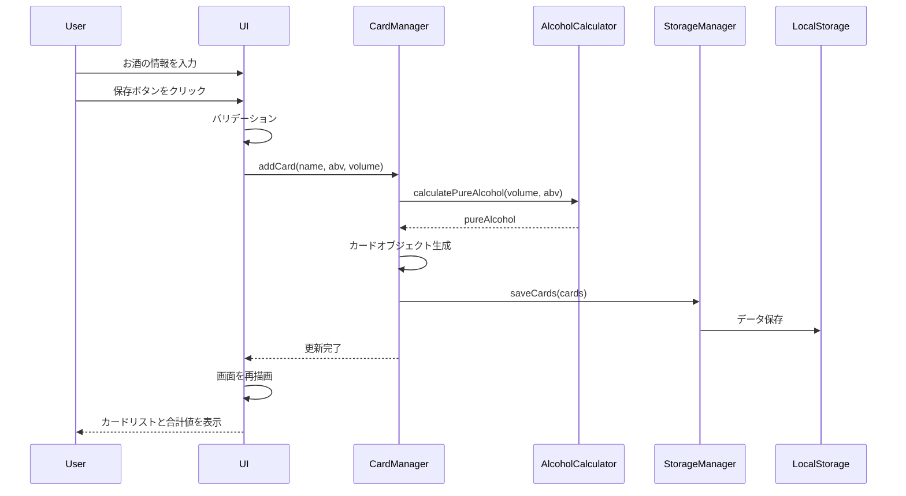

# 設計書

## 概要

純アルメーターは、シングルページアプリケーション（SPA）として実装します。フロントエンドのみで完結するシンプルな構成とし、HTML/CSS/JavaScriptを使用して構築します。酔っている状態でも操作しやすいよう、大きなボタンと明確な視覚的フィードバックを提供します。

## アーキテクチャ

### システム構成

```
┌─────────────────────────────────────┐
│         ブラウザ                     │
│  ┌───────────────────────────────┐  │
│  │   純アルメーター UI            │  │
│  │  ┌─────────────────────────┐  │  │
│  │  │  合計表示エリア          │  │  │
│  │  └─────────────────────────┘  │  │
│  │  ┌─────────────────────────┐  │  │
│  │  │  入力フォーム            │  │  │
│  │  └─────────────────────────┘  │  │
│  │  ┌─────────────────────────┐  │  │
│  │  │  カードリスト            │  │  │
│  │  │  ┌─────┐ ┌─────┐       │  │  │
│  │  │  │Card1│ │Card2│ ...   │  │  │
│  │  │  └─────┘ └─────┘       │  │  │
│  │  └─────────────────────────┘  │  │
│  └───────────────────────────────┘  │
│  ┌───────────────────────────────┐  │
│  │   LocalStorage                │  │
│  │   (データ永続化)               │  │
│  └───────────────────────────────┘  │
└─────────────────────────────────────┘
```

### 技術スタック

- **HTML5**: セマンティックなマークアップ
- **CSS3**: レスポンシブデザイン、カード型レイアウト
- **Vanilla JavaScript**: フレームワークなしのシンプルな実装
- **LocalStorage API**: データの永続化

## コンポーネントとインターフェース

### 1. データモデル

#### DrinkCard

```javascript
{
  id: string,           // ユニークID（UUID）
  name: string,         // お酒の名前
  abv: number,          // アルコール度数（0-100）
  volume: number,       // 飲んだ量（ml）
  pureAlcohol: number,  // 純アルコール量（ml）計算値
  timestamp: number     // 登録日時（Unix timestamp）
}
```

### 2. UIコンポーネント

#### TotalDisplay（合計表示コンポーネント）

**責務**: 純アルコール量の合計を大きく表示

**表示内容**:
- 合計純アルコール量（ml）
- 視覚的に目立つデザイン（大きなフォント、背景色）

#### InputForm（入力フォームコンポーネント）

**責務**: 新しい飲酒記録の入力

**入力フィールド**:
- お酒の名前（text input）
- ABV（number input, 0-100, step=0.1）
- 飲んだ量（number input, min=1, step=1）

**バリデーション**:
- 全フィールド必須
- ABVは0-100の範囲
- 飲んだ量は正の数

#### CardList（カードリストコンポーネント）

**責務**: 登録された飲酒記録をカード形式で表示

**各カードの表示内容**:
- お酒の名前（大きく表示）
- ABV（%表示）
- 飲んだ量（ml表示）
- 純アルコール量（ml表示、強調）
- 削除ボタン（大きなタップ領域）

### 3. ビジネスロジック

#### AlcoholCalculator

**責務**: 純アルコール量の計算

```javascript
calculatePureAlcohol(volume, abv) {
  return (volume * abv / 100).toFixed(1);
}
```

#### StorageManager

**責務**: LocalStorageとのデータ同期

**メソッド**:
- `saveCards(cards)`: カードデータを保存
- `loadCards()`: カードデータを読み込み
- `clearCards()`: 全データを削除

#### CardManager

**責務**: カードの追加・削除・取得

**メソッド**:
- `addCard(name, abv, volume)`: 新しいカードを追加
- `deleteCard(id)`: 指定IDのカードを削除
- `getAllCards()`: 全カードを取得
- `getTotalPureAlcohol()`: 合計純アルコール量を計算

## データフロー



## エラーハンドリング

### バリデーションエラー

- **空の入力**: 「全ての項目を入力してください」
- **ABV範囲外**: 「アルコール度数は0〜100の範囲で入力してください」
- **飲んだ量が不正**: 「飲んだ量は1ml以上を入力してください」

### ストレージエラー

- **LocalStorage利用不可**: 「ブラウザのストレージが利用できません。プライベートモードを解除してください」
- **容量超過**: 「保存容量が不足しています。古いデータを削除してください」

### エラー表示方法

- フォーム上部に赤色の警告メッセージを表示
- 3秒後に自動的に消える
- エラー時は入力フィールドを赤枠で強調

## UI/UXデザイン

### デザイン原則

1. **大きなタップ領域**: 最小44x44pxのタップ領域を確保
2. **明確なコントラスト**: 背景と文字のコントラスト比4.5:1以上
3. **シンプルな操作**: 最小限のステップで目的を達成
4. **即座のフィードバック**: 操作後すぐに結果を表示

### カラースキーム

- **プライマリカラー**: #4CAF50（緑）- 保存ボタン
- **セカンダリカラー**: #2196F3（青）- 合計表示エリア
- **警告カラー**: #f44336（赤）- 削除ボタン、エラー表示
- **背景カラー**: #f5f5f5（ライトグレー）
- **カードカラー**: #ffffff（白）

### レスポンシブデザイン

- **モバイルファースト**: 320px幅から対応
- **タブレット**: 768px以上で2カラムレイアウト
- **デスクトップ**: 1024px以上で最大幅を制限

## テスト戦略

### 単体テスト

- `AlcoholCalculator.calculatePureAlcohol()`: 計算ロジックの正確性
- `StorageManager`: LocalStorageの読み書き
- `CardManager`: カードの追加・削除・取得

### 統合テスト

- フォーム入力からカード表示までの一連の流れ
- カード削除後の合計値更新
- ページリロード後のデータ復元

### E2Eテスト（手動）

- 実際のブラウザでの操作性確認
- 酔った状態を想定した操作テスト
- 各種ブラウザでの動作確認

### テストケース例

1. **正常系**: 正しい値を入力してカードが追加される
2. **異常系**: 不正な値を入力してエラーが表示される
3. **境界値**: ABV=0, 100での動作確認
4. **削除**: カード削除後に合計値が正しく更新される
5. **永続化**: リロード後にデータが復元される

## パフォーマンス考慮事項

- **初期ロード**: 外部ライブラリなしで高速ロード
- **描画**: 仮想DOMなしでも十分な速度（カード数100件程度まで）
- **ストレージ**: LocalStorageの容量制限（5MB）を考慮
- **メモリ**: カードデータをメモリ上に保持し、描画時に参照

## セキュリティ考慮事項

- **XSS対策**: ユーザー入力をエスケープして表示
- **データ検証**: クライアント側でのバリデーション
- **プライバシー**: データはローカルのみに保存（サーバー送信なし）

## 将来の拡張性

### Phase 2で検討可能な機能

- 日付別の記録管理
- グラフ表示（日別・週別の飲酒量）
- お酒のプリセット登録
- エクスポート機能（CSV、JSON）
- 健康目標設定とアラート
- PWA化（オフライン対応、ホーム画面追加）
